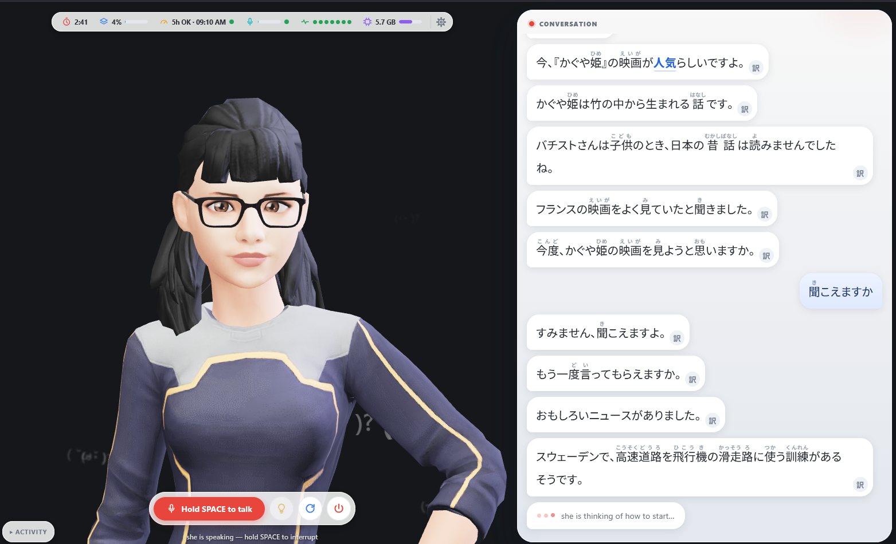

<p align="center"></p>

# atama-AI (頭AI)

**Real-time voice Japanese tutor with a 3D avatar.** Speak Japanese to a 3D sensei that knows
where you are in your WaniKani and Bunpro studies and matches its vocabulary and grammar to it.

<p align="center">
  
</p>
<p align="center"><em>Sensei mid-conversation: status bar, push-to-talk, and the transcript with furigana and per-sentence translation.</em></p>

Everything runs on one laptop except Claude inference. No cloud STT, no cloud TTS, no database,
no accounts: one user, local files. **It never writes to your SRS accounts.**

> **Golden Rule.** This application **never sets or writes anything through the WaniKani or
> Bunpro API keys.** It is read-only by construction, verified mechanically at every build and
> start. `make test`, `make run`, `make doctor`, backend import, `npm run build` and the
> pre-commit hook all run a gate that fails on any write call or any setter-shaped name in the
> SRS code. The same transport refuses to send a token to any host but `api.wanikani.com` or
> `api.bunpro.jp`, because the origins are constants rather than settings. There is no bypass.
> Details: spec §0, ADR-021, ADR-023.

> **Status: M3, the page.** M0 to M2 are built (M2 declared done by the user, ADR-034) and M4's
> code is complete. You talk to the Vite + TypeScript page in `frontend/`. What is not done is
> every gate that needs a live session: barge-in timing, the acceptance conversation, VRAM. They
> are listed in [ROADMAP.md](ROADMAP.md). [ATAMA-AI_SPEC.md](ATAMA-AI_SPEC.md) is the
> authoritative build document, and [ADR.md](ADR.md) says why the stack is pinned the way it is.

---

## Table of contents

- [What it does](#what-it-does)
- [Architecture](#architecture)
- [Tech stack](#tech-stack)
- [Hard requirements](#hard-requirements)
- [Getting started](#getting-started)
- [Claude login](#claude-login)
- [Settings](#settings)
- [SRS integration (read-only)](#srs-integration-read-only)
- [Status bar](#status-bar)
- [The avatar](#the-avatar)
- [Emotions](#emotions)
- [The tutor prompt](#the-tutor-prompt)
- [Repo layout](#repo-layout)
- [Milestones](#milestones)
- [Design rules](#design-rules)
- [Measuring latency](#measuring-latency)
- [Troubleshooting](#troubleshooting)
- [Memory](#memory)
- [Credits and licensing](#credits-and-licensing)
- [Documents](#documents)

---

## What it does

You talk. The avatar listens, thinks, and talks back in Japanese at your level, with lip-synced
speech and a voice and face that match its mood.

The brain is **Claude Code running headless** (`claude -p`) as a single persistent subprocess on
your existing subscription auth, not the Anthropic API. At session start the tutor is given a
compact **Student Profile** built from your WaniKani level, recent unlocks and leeches, plus your
Bunpro JLPT progress and ghost reviews. It works your weak items into normal conversation.

What it gives you:

- **Voice in, voice out.** Mic, VAD, Whisper, Claude, VOICEVOX, animated avatar.
- **Barge-in.** Start talking while the avatar is speaking and it stops in under 300 ms, flushes
  its queue and takes you as the next turn. It does not interrupt itself on laptop speakers.
- **Real lip-sync.** VOICEVOX mora timings become Oculus visemes. Nothing is guessed from text.
- **Emotion end to end.** The tutor tags sentences `[happy]`, `[thinking]`, `[surprised]`,
  `[serious]`, `[encouraging]`, `[proud]` or `[confused]`. The tag drives the VOICEVOX voice style
  and the avatar's face together, when that sentence plays.
- **Read-only SRS.** WaniKani and Bunpro are never written to. Enforced at token, client and tool
  level rather than by a prompt.
- **Status bar.** You can see whether WaniKani, Bunpro, the Bunpro MCP, Claude, VOICEVOX and
  Whisper are working, not just configured.
- **A settings page instead of dotfiles.** Tokens, voice, VAD, model and display are configured in
  the app.
- **A correction policy that respects flow.** Minor errors get a natural recast; errors that break
  the meaning get one sentence of correction and a retry.
- **Mineable logs.** Every turn lands in `logs/sessions/<date>-<session>.jsonl` with transcript,
  reply, timings, emotion and tool calls, ready for Anki.

---

## Architecture

```
Browser (frontend/, Vite + TypeScript)     Python Orchestrator (backend)
┌──────────────────────────────────┐  WS   ┌──────────────────────────────┐
│ left: TalkingHead avatar         │  /ws  │ FastAPI + asyncio  (app.py)  │
│   visemes, emotion at audio start│ :8000 │  ├─ Hub: fan-out, turn epochs│
│ right: chat thread               │◄─────►│  ├─ VoiceLoop (PTT | VAD)    │
│   red grammar · word cards ·     │       │  ├─ VAD (silero)             │
│   translate · hint               │       │  ├─ STT (faster-whisper)     │
│ status bar · settings · SPACE    │       │  ├─ Brain → claude -p        │
└──────────────────────────────────┘       │  ├─ SentenceChunker (+ tags) │
  src/protocol.gen.ts is generated         │  ├─ Annotator: furigana,     │
  from backend/models.py (gate M3a)        │  │   cached explain via      │
                                           │  │   claude -p (haiku)       │
        ┌─────────────┐                    │  ├─ TTS client → VOICEVOX    │
        │ VOICEVOX    │◄──HTTP─────────────┤  ├─ SRS fetcher (WK/Bunpro)  │
        │ (Docker)    │  :50021            │  ├─ Memory/tutor + rotation  │
        └─────────────┘                    │  └─ Status registry          │
        ┌─────────────┐                    └───────────┬──────────────────┘
        │ SearxNG     │◄──HTTP :8888──┐                │ stdin/stdout
        │ (Docker)    │               │                ▼
        └─────────────┘   ┌───────────┴──┐        claude -p (persistent subprocess,
  Yahoo! JAPAN RSS ◄─GET──┤ search MCP   │◄───────stream-json in/out, MCP tools)
  (news_feeds.txt)        │ (1 tool)     │             │
                          └──────────────┘             └──► Bunpro MCP (3 read tools,
                                                            reads the SRS snapshot)

  run.cmd / up.py  : docker up → wait ready → build the page if stale → orchestrator → open page
  stop.cmd / down.py, or the page's stop button (control quit): tutor, server AND containers
```

**Today** the page (`frontend/`, Vite + TypeScript) shows the tutor with lip-sync and a face that
changes as each sentence starts, plus subtitles, the status bar and the settings panel. Hold SPACE
to talk, press it again to interrupt her, and hold **ALT GR** mid-sentence to throw away what you
are recording (the right-hand ALT, because Chrome keeps SPACE with the left one). Nothing is
transcribed and nothing is sent: let SPACE go, press it again, start over.

Your **microphone is captured by the orchestrator** (sounddevice, with unplug recovery), not by
the browser, so step 1 below is not yet how it works.

**The conversation panel** (ADR-036, Settings → Display) puts the tutor on the left and the
conversation on the right as a chat:

- Grammar points she uses and words from your own WaniKani lists are marked in **the colour of
  their level**, Bunpro's scale for both: ghost grey, beginner dark teal, adept navy, seasoned
  purple, expert pink, master rose (a WaniKani Apprentice word is beginner, Guru adept, and so on;
  a leech is a ghost). Grammar wears a solid bar, a word a dotted one; the legend is in the chat
  header. Click a grammar point for the rule, in English or Japanese (Settings → Display); click a
  word for its reading, meaning and level of mastery. She marks both herself; a point or word she
  forgot is still found by the tokenizer, by whole words only.
- Reloading the page brings the conversation so far back.
- The **lightbulb** lights when she wants you to use a particular form or word. Click it to see
  which.
- Kanji carry **furigana** (Settings → Display: all, only the ones you have not reached Guru on,
  or none). In a compound, each kanji is judged on its own: 日本語 shows a reading over 語 alone
  once 日 and 本 are yours. Where WaniKani lists no reading that fits, add a dotted correction to
  `backend/data/readings.txt` (`日本語 に.ほん.ご`).
- The 訳 button on any of her sentences shows its English. Every answer is written once and kept,
  so the second time is instant.
- When you use something you are still learning, the word drifts up behind her.

| Service         | Port     | Bound to      |
|-----------------|----------|---------------|
| Orchestrator    | `:8000`  | `127.0.0.1`   |
| VOICEVOX engine | `:50021` | `127.0.0.1`   |
| Frontend (dev)  | `:5173`  | `localhost`   |

**Loopback only.** The WebSocket carries the tutor's audio, your transcripts and your study marks,
and nothing listens on the LAN. `make doctor` fails if anything does. The socket also refuses any
page that is not its own: the handshake's `Origin` must be `127.0.0.1`, `localhost` or `[::1]` at
the app's port (or the Vite dev server), so another site open in your browser cannot drive the
lesson.

### One turn, end to end

1. The orchestrator captures the microphone (sounddevice, 16 kHz mono); the page only holds the
   turn open — **hold SPACE** — with `control: start` / `stop` over the WebSocket. No audio goes
   from browser to server.
2. Releasing the key ends the turn. (In `TURN_MODE=vad`, Silero VAD ends it after
   `VAD_SILENCE_MS` of silence instead, 900 ms by default.)
3. faster-whisper transcribes with `language="ja"`.
4. The transcript is written to the Claude subprocess stdin as newline-delimited stream-JSON.
5. Claude's streamed text is cut into sentences at `。！？…\n` **as tokens arrive**, and each
   sentence carries its emotion tag.
6. Each sentence hits VOICEVOX `audio_query` and `synthesis` with the emotion's voice style and
   pitch, speed and intonation, producing a WAV and mora timings.
7. Mora timings become an Oculus viseme timeline. `{audio, visemes, vtimes, vdurations, text,
   emotion}` goes to the browser.
8. TalkingHead `speakAudio(...)` plays it with lip-sync, and the face takes the emotion the moment
   the audio starts.
9. If you press the key mid-playback, **barge-in** stops the audio on the key event itself,
   flushes the TTS queue, interrupts the tutor's turn in the `claude` process (its own interrupt
   request on stdin, never a signal — ADR-037), marks the remaining text undelivered and starts
   the next turn. Because a key press ends turns, the avatar's own voice through the speakers
   cannot end one; in `vad` mode a raised, state-gated VAD threshold does that job.

Stages are pipelined: TTS for sentence *N* overlaps generation of sentence *N+1*, and the first
sentence ships the instant it closes.

---

## Tech stack

Pinned. Substituting a piece is a conversation rather than a refactor, and the reasoning for each
choice is in [ADR.md](ADR.md).

**Backend.** Python 3.11+, FastAPI, uvicorn, starlette WebSockets, httpx, pydantic v2.

**Speech.** `faster-whisper` (`large-v3`, CUDA, `float16`) and `silero-vad`.

**TTS.** VOICEVOX engine via the official Docker image, CPU build, and it stays on CPU by design.

**Frontend.** Vite and vanilla TypeScript, three.js, and
[`@met4citizen/talkinghead`](https://github.com/met4citizen/TalkingHead) v1.7+. No React, no state
library. One page plus a settings page and a few modules.

**Brain.** The `claude` CLI (verified against 2.1.159), headless, subscription auth.

**Orchestration.** docker-compose for VOICEVOX and SearXNG, both on loopback and both **pinned**
(`voicevox/voicevox_engine:cpu-0.25.2`, `searxng/searxng:2026.9.8-3fdc6d753` — bumping a tag is a
deliberate change that re-verifies what the pin protects, ADR-015). Everything else runs bare so
Whisper gets the host GPU.

---

## Hard requirements

Two numbers are non-negotiable. Both are instrumented and both gate milestone acceptance.

### Latency: 5.0 s voice-to-voice at p90

| Stage                              | Budget            |
|------------------------------------|-------------------|
| End-of-speech detect (VAD window)  | 0.50 s            |
| STT (Whisper, warm)                | 0.35 s            |
| Claude first complete sentence     | 3.60 s            |
| VOICEVOX first chunk + WS delivery | 0.40 s            |
| Playback start slack               | 0.15 s            |
| **Voice-to-voice total**           | **≤ 5.0 s (p90)** |

**It was 3.0 s until 2026-09-10.** Sonnet always thinks a little before answering and that cannot
be switched off, so getting under 3 s meant a weaker answer. A considered answer is worth two more
seconds (ADR-033). Claude is still the variable stage, so its settings are enforced: effort
`medium` (thinking kept down, not off), a compact system prompt (profile ≤ 600 tokens), **every
built-in tool removed** (`--tools ""`), and rationed MCP tool use. `model` and `fallback model` are
settings, so you can drop to a faster model if p90 drifts.

Fillers (a pre-synthesised うーん、そうですね… if the first sentence has not closed by 1.2 s) are
part of the design (ADR-008) but **not built** — deferred to the end of the project. When they
come they are masking, not budget compliance, so true first-content latency stays the number.
What is measured today: `first_play_ms`, when her first sentence started playing (for the browser,
the hand-over to the page), is the voice-to-voice figure; `first_audio_ms` is when its synthesis
finished. Any turn over 5.0 s logs a warning with the full stage breakdown, and rolling p50 and
p90 go into the session log and the page's timing line.

### VRAM: 8 to 10 GB cap on a 16 GB RTX-generation card

| Component                                  | Allocation  |
|--------------------------------------------|-------------|
| faster-whisper `large-v3` @ `float16`      | **3.8 GB measured** |
| Silero VAD                                 | < 0.1 GB    |
| CUDA context + fragmentation reserve       | ~1 GB       |
| Browser / three.js (shares the GPU)        | ~1 GB       |
| **Total**                                  | **~5.6 GB** |

- VOICEVOX stays on CPU. Always.
- `make doctor` and the orchestrator's VRAM watch report `nvidia-smi` usage and warn above 10 GB.
- If VRAM gets tight, set `WHISPER_COMPUTE_TYPE=int8_float16` (2.2 GB, costs accuracy) before
  dropping to `medium` int8 in settings. Do not breach the cap.
- The remaining 6 GB or so is reserved for a future photoreal (MuseTalk) experiment.

---

## Getting started

**Target machine:** a single laptop with an NVIDIA RTX-generation GPU (16 GB VRAM), running Linux
or Windows/WSL2.

### Which machines this runs on

**It needs an NVIDIA GPU with CUDA.** Speech recognition is faster-whisper (CTranslate2) with
`device="cuda"`, and the 5 s budget is written around a warm GPU model. The rest of the stack is
portable: VOICEVOX is the CPU Docker image, the VAD and the avatar are CPU and WebGL, and the
`claude` CLI runs anywhere.

| | |
|---|---|
| **Windows 10/11 + NVIDIA** | Supported, and the machine it is developed on. Launch with the `run` and `stop` scripts in the repo root. |
| **Windows + WSL2 + NVIDIA** | Supported. See [Windows + WSL2](#windows--wsl2). The backend lives on the WSL2 side. |
| **Linux + NVIDIA** | Supported, and the reference topology in the spec (§15): everything on the host, `make run`. Nothing in the code is Windows-only; `run.cmd` and `stop.cmd` wrap `python -m backend.tools.up` and `down`. |
| **macOS, or any machine without an NVIDIA GPU** | **Not supported today.** CTranslate2 has no Metal backend and the STT device is not configurable, so it would fall back to CPU, which the latency budget does not survive at `large-v3`. |

Making it work on a Mac is possible rather than promised: it needs a second STT backend
(whisper.cpp or MLX Whisper on Apple Silicon), an STT device setting that does not exist today,
and the latency gate re-measured. The rest of the stack already runs there.

### Prerequisites

- Python 3.11+
- Node 20+ (builds the avatar page; `make run` and the `run` script do it for you)
- Docker, with the engine running (VOICEVOX and SearXNG are containers; both images are pinned)
- An NVIDIA GPU with CUDA available to CTranslate2
- The `claude` CLI, logged in. See [Claude login](#claude-login).
- A GLB avatar. See [The avatar](#the-avatar).
- Headphones for the first session, recommended but not required. See
  [Troubleshooting](#troubleshooting).

Optional, and the reason the app exists: a **read-only** WaniKani API token and a Bunpro API key.

### Setup

```bash
git clone <this-repo> atama-ai
cd atama-ai

python -m venv .venv          # then activate it
pip install -e ".[dev]"       # every dependency, declared in pyproject.toml
make avatar                   # fetch the default avatar (see the licence note below)

make run                      # start everything and open the avatar
make stop                     # stop everything, containers included
```

**On Windows there is no `make`.** Use the wrappers, which do the same thing:

```powershell
.\run                          # start everything and open the avatar
.\stop                         # stop everything
```

**Check the machine first:** `make doctor` (or `.venv/Scripts/python -m backend.tools.doctor` on
Windows). It prints one PASS / WARN / FAIL line per check with what to do: the `claude` CLI and its
version, `ANTHROPIC_API_KEY` absent from your shell, a trivial `claude -p` probe proving
subscription auth (`init.apiKeySource == "none"`), VOICEVOX / the app port / SearXNG on loopback
and not on the LAN, the Docker engine and its containers, which tokens are set, the WaniKani
scopes to leave unticked, `.gitignore`, the pre-commit hook, CUDA via `nvidia-smi`, the persona's
avatar, and which platform topology it detected; then the last status table. It makes **no**
request to WaniKani or Bunpro unless you pass `--live`, which sends exactly one GET per configured
token to prove it authenticates (the APIs are otherwise contacted only at launch and Refresh,
ADR-024). `--skip-claude` skips the probe and saves about ten seconds. The exit code is non-zero
on any FAIL.

`make run` brings up the containers, waits until VOICEVOX genuinely answers rather than assuming
it, builds the avatar page if its source is newer than the last build (the first time it also runs
`npm ci` in `frontend/`), starts the tutor with the browser avatar, and opens the page. **Hold
SPACE and talk.** Press it while she is talking to interrupt her, and hold **ALT GR** while
recording to drop what you just said.

Ctrl+C stops the tutor and leaves the containers running, because they are slow to start and cheap
to keep. `make stop` is separate and deliberate. The **stop button on the page** is the other kind
of exit: it means you are done for today, so it takes the containers down as well.

If neither works, both are plain modules: `python -m backend.tools.up` and
`python -m backend.tools.down`.

**The page** (`frontend/`, Vite + TypeScript, no framework, ADR-009). Working on it:

```bash
cd frontend
npm ci                  # once
npm run dev             # hot reload on http://127.0.0.1:5173, socket forwarded to a running tutor
npm test                # headless unit tests (Vitest)
npm run build           # type-check, then build into frontend/dist (served at /)
```

Its message types are **generated** from `backend/models.py`. After changing a message there, run
`python -m backend.tools.gen_protocol`. The Python tests fail until you do, and `npm run build`
fails while any server message has no handler on the page. If the launcher cannot build the page
and there is no earlier build, it stops and says why instead of opening an empty tab.

Then open `http://localhost:5173`. On a first run with nothing configured the page shows a
**Connect your study data** card, and one button opens Settings → Account, where you paste your
read-only WaniKani and Bunpro keys. There is no `.env` and nothing to create by hand. You can skip
it: the lesson runs without keys, the tutor teaches as if you were starting from scratch, and the
launch says so.

Allow mic access, and start talking.

### The avatar (fetched, not committed)

> **The default avatar is non-commercial. If you are shipping anything commercial, replace it
> first, and note that making your own at Ready Player Me does not lift the restriction.** See
> [LICENSE](LICENSE) §1 for what does. For personal study it is fine as it stands.

`*.glb` is git-ignored, so a fresh clone has no face until you fetch one. Each persona names its
own file (`prompts/minami.md` declares `<!-- avatar: minami.glb -->`), so the filename is the whole
wiring.

It must be a **full-body GLB** with a Mixamo-compatible rig and **both** blendshape sets, **ARKit
(52)** and **Oculus visemes (15)**. TalkingHead needs all of them. This is the part that fails
quietly: an avatar missing them loads, renders perfectly, and never moves its mouth.

Fetch the known-good default (TalkingHead's reference avatar, CC BY-NC 4.0):

```bash
python -m backend.tools.get_avatar
```

Or supply your own from [Avaturn](https://avaturn.me), exported with both morph-target groups:

```
https://models.readyplayer.me/<YOUR_ID>.glb?morphTargets=ARKit,Oculus%20Visemes
```

**Verify before building on it:**

```bash
python -m backend.tools.check_avatar
```

```
frontend/public/avatar.glb  (4.7 MB, 72 morph targets)
  Oculus visemes : 15/15   ok
  ARKit (sampled): 10/10   ok
Usable by TalkingHead.
```

If anything is missing it names it and says how to re-export. It already caught an example avatar
missing `viseme_sil`, the closed-mouth rest shape, which would have talked without ever shutting
its mouth.

### Windows + WSL2

- **Inside WSL2:** the Python backend, the `claude` CLI and its login, `make`, and Docker via
  Docker Desktop's WSL2 integration. Check `nvidia-smi` works inside WSL2 before anything else.
  Keep the repo on the WSL2 filesystem (`~/…`), not `/mnt/c/…`, because the bridge is slow enough
  to show up in the latency budget.
- **On Windows:** only the browser. WSL2 forwards `localhost`, so `http://localhost:5173` works,
  and because everything is bound to loopback it stays off the LAN.
- The mic is captured by the **backend** (sounddevice), not the browser, so under WSL2 the backend
  needs an audio device it can open — WSL2 has none by default. This topology is documented, not
  verified; the machine this is developed on is native Windows.

---

## Claude login

The tutor runs on your Claude **subscription** through the `claude` CLI, never the API. There are
two ways to log in:

1. **Interactive (default).** Run `claude` once in a terminal **on the machine that runs the
   backend** (inside WSL2 on Windows, because credentials live in the WSL home), then `/login`. A
   browser opens, or a URL is printed to paste. Credentials are stored under `~/.claude/`, outside
   the repo, and refresh themselves. Headless `claude -p` reuses them.
2. **Long-lived token.** Run `claude setup-token` (interactive, requires a subscription) and paste
   the token into the settings page as the Claude OAuth token. Use this when the backend runs
   somewhere the interactive login is awkward.

`make doctor` proves which is active: it runs a trivial prompt in stream-json mode, under the same
spawn rules as the tutor (allowlisted environment, cwd outside the repo, no shell), and asserts
`init.apiKeySource == "none"`, the only reliable signal that you are on subscription rather than
API billing. It also **fails hard if `ANTHROPIC_API_KEY` is set in your shell**, because that
variable silently overrides subscription auth and bills the API.

Subscription rate limits are real for a chatty voice app. When the CLI reports one, the status bar
shows it and the configured fallback model carries the conversation.

---

## Settings

Configuration lives in the app's **settings page** and is stored in `settings.json` (repo root,
git-ignored, mode `0600` where the OS has file modes — on Windows your profile's ACLs are the
protection). There is no `.env` to edit. A value outside its type, choices or range stops the
launch with one line (`ConfigError`) rather than starting on it.

**Built today:** the cog at the right end of the status bar (or `/#settings`, `/#settings/sound`)
opens a panel generated from `config.py` with every key, grouped, typed, and described. Tabs:
Account, Brain, Voice, Sound, Display, Advanced. Save writes `settings.json`. The **microphone and
output pickers list what is plugged in right now** and apply at once; everything else applies the
next time you launch. Live apply of the rest is not built yet, and there are no per-service Test
buttons (`make doctor` and the status chips are the check). A key
set in an `ATAMA_*` environment variable shows as **set in environment** and is locked, because
that overrides `settings.json` and a value saved here would be ignored. `HOST` is never editable
from the page (ADR-017).

**`.env` is gone** (2026-09-12). It used to be read between `settings.json` and the environment,
which made it a trap: a key set there could not be changed from the panel. The app does not read it
at all now. If you have one, the launch tells you, and `python -m backend.tools.migrate_env`
imports it into `settings.json` in one command, tokens included (it backs the file up first, and
`--dry-run` previews).

**Unplugging is fine.** No microphone at launch, a headset pulled out mid-lesson, a chosen device
that is missing: the app keeps running on the system default and switches back when the device
returns (spec §9). The page shows the microphone's state under the talk button.

| Group              | What's there                                                                 |
|--------------------|------------------------------------------------------------------------------|
| Account & tokens   | WaniKani token, Bunpro API key, Claude OAuth token, masked                   |
| Brain              | Claude model, effort level, fallback model, per-turn timeout, memory and rotation, today's targets (`STUDY_*`) |
| Voice              | VOICEVOX speaker override, speed, pitch, intonation, pause scale             |
| Sound              | Turn mode (push-to-talk / hands-free), microphone and output device, VAD window and thresholds, barge-in sensitivity |
| Display            | Subtitles (JP / off), furigana, chat panel, explanation language, status heartbeat |
| Advanced           | Ports and bind address, cache and log dirs, STT confidence thresholds, latency and VRAM warning thresholds, service URLs and timeouts |

Today the microphone and output pickers and the tutor persona apply live; every other change
applies at the next launch (the model respawn with `--resume` and the live re-fetch on a token
change are the design, not yet built). There are no per-service Test buttons: the status chips
and `make doctor` answer "does it work".

Secrets never come back to the browser. Once stored, the page only ever sees
`{set: true, hint: "…abcd"}`.

**Environment variables** are an optional override layer for automation (defaults, then
`settings.json`, then `ATAMA_*`). `backend/config.py` is the complete inventory: every key with its
type, default, group and description, and the settings page is generated from it.

---

## SRS integration (read-only)

Both sources are optional and fetched in parallel at session start within a 10 s budget. The app
runs fine with zero, one, or both configured.

**This application never writes to WaniKani or Bunpro.** Not from the orchestrator, not from the
MCP server, not from Claude. Three independent layers enforce it, and a standing test records every
outgoing request in a full mocked session and asserts all are `GET`:

1. **Token scope.** Create your WaniKani token with **no write permissions ticked**
   (`assignments:start`, `reviews:create`, `study_materials:*`, `user:update` all unticked).
   WaniKani's API does not report a token's scopes, so nothing can check this for you:
   `make doctor` prints the list to leave unticked, and `make doctor --live` sends one GET per
   token to prove it authenticates.
2. **Client.** Every SRS module is built on one HTTP client that has a `get()` method and nothing
   else. There is no write method to call.
3. **Tool surface.** The Bunpro MCP server exposes read tools only (`get_review_queue`,
   `get_ghost_reviews`, `get_grammar_progress`). A community server with write tools is
   disqualified unless they can be removed from the surface.

**The APIs are contacted only at app launch and when you press Refresh.** Nothing else calls them:
not a timer, not a conversation turn, not the MCP tools. Each sync stores a snapshot, the status
chips show `synced HH:MM`, and the Bunpro MCP tools read that snapshot (and tell the tutor how old
it is) rather than calling Bunpro, so the MCP server holds no token at all.

Why do you still need tokens if Claude uses MCP? MCP is only the transport that lets Claude call a
tool mid-conversation. The tool still has to authenticate to WaniKani and Bunpro as you. Tokens
never enter the `claude` process itself, only the MCP server that needs them, through the `env`
block of its `mcp.json` entry.

- **WaniKani** (official, stable). Level, item counts by SRS stage, every vocabulary item still
  below Guru, and about 15 leeches. The rate limit (about 60 req/min) is respected and results are
  fetched at every launch and on Refresh, and stored to disk between them (`SRS_CACHE_TTL_S`, default 0, re-uses a younger snapshot at launch if you set it).
- **Bunpro** (unofficial, treated as fragile). JLPT progress and the grammar you have not settled
  yet (ghosts first, then beginner, adept and seasoned) for the static profile, plus a small MCP
  server written in this repo so Claude can check your review queue mid-conversation, on request or
  roughly every 15 minutes. The credential is the **Account API Token from Bunpro → Settings →
  API**; the app never asks for your Bunpro email or password and never reads browser cookies.
  Bunpro has no official API, so these endpoints can change without warning. Every response is
  validated and a change shows up as a red chip rather than as wrong data. Every call is wrapped,
  failures log a warning, and the session continues. Bunpro breakage never blocks startup. The
  sanitised fixtures the tests run against come from `make capture-bunpro`, which captures the
  eight launch endpoints including `srs_level_{beginner,adept,seasoned}_grammar`.

A sync in which some endpoints failed is kept as `partial` and fetched again at the next launch;
an HTTP 429 ends that service's sync with no retry and the chip reads `stale` (rate limited).
WaniKani collections are paged (up to 20 pages each — more than a level-60 account needs) and a
truncated one is reported on the chip rather than silently short.

The result is rendered into a **Student Profile** (≤ 600 tokens) injected into the tutor prompt, and
written to `logs/profile-<date>.json` for debugging.

---

## Status bar

A row of chips, always visible, one per dependency, driven by real signals rather than by whether a
value is configured:

| Chip         | States                                                                          |
|--------------|---------------------------------------------------------------------------------|
| WaniKani     | `disabled` · `syncing` · `ok` (level, synced HH:MM) · `stale` (serving cache) · `error` |
| Bunpro       | same, for the session-start fetch                                                |
| Bunpro MCP   | `disabled` · `starting` · `connected` · `failed` · `used` (last call HH:MM, ok/error) |
| Claude       | `starting` · `ready` · `thinking` · `rate_limited` · `fallback` · `restarting` · `error` |
| VOICEVOX     | `loading` · `warm` (engine version, N styles) · `ok` (up, not preloaded) · `down` |
| STT          | `loading` · `warm` (model, VRAM MB) · `error`                                    |

`stale` is not an error: the tutor still has a profile, just an older one. Click a chip for detail,
and hit **resync** to force a re-fetch past the cache TTL. `make doctor` prints the same table and
the session log header records it, so a bad session can be diagnosed afterwards. Error text is
sanitised before it reaches a chip, so a token never appears there.

---

## The avatar

Bring your own GLB from **Ready Player Me** or **Avaturn**. It must include **ARKit and Oculus
viseme blendshapes**, which RPM exports include by default. Follow the export parameters in the
TalkingHead README (Appendix A).

Place it at `frontend/public/avatar.glb` (git-ignored).

The avatar is framed waist-up in a full-viewport canvas, blinks every 2 to 6 s, sways subtly, and
tracks the camera with `lookAt`. While you speak it takes an attentive pose and nods on your pauses,
the あいづち a human tutor gives. While thinking, it looks up and away.

Lip-sync always goes through `speakAudio` with an explicit viseme timeline. TalkingHead's
text-based lip-sync has no Japanese module, so `speakText` is never used.

### Mora to viseme mapping

Implemented as one pure, unit-tested function with golden tests against committed `audio_query`
fixtures:

| Input                     | Viseme                        |
|---------------------------|-------------------------------|
| Vowels a / i / u / e / o  | `aa` / `I` / `U` / `E` / `O`  |
| ん (N)                     | `nn`                          |
| っ (cl), pause             | `sil`                         |
| k, g                      | `kk`                          |
| s, z, sh, j, ts           | `SS`                          |
| t, d                      | `DD`                          |
| ch                        | `CH`                          |
| n                         | `nn`                          |
| m, b, p                   | `PP`                          |
| f, h                      | `FF`                          |
| r                         | `RR`                          |
| w, y                      | skipped, the vowel dominates  |

Timings honour `prePhonemeLength` and divide by `speedScale`, including the per-emotion speed.
Devoiced vowels (VOICEVOX marks them with an uppercase vowel) keep the shape, but the frontend caps
their weight at about 0.4.

---

## Emotions

The tutor may open the turn, or any later sentence, with exactly one of `[happy]` `[thinking]`
`[surprised]` `[serious]` `[encouraging]` `[proud]` `[confused]`. It picks the tag for how the
sentence should sound. The tag is stripped before TTS and applies to that sentence and the ones
after it until the next tag; the face settles back to neutral at the end of the turn, not on a
timer. Tags are case-insensitive, `[neutral]` resets, and a TalkingHead mood name in brackets is
stripped and logged, never spoken. The table below shows the original five rows; all seven have a
voice row (`backend/emotions.py`) and a face row (`frontend/src/rig.ts`), and a test keeps the two
in step.

One tag drives two outputs from one config table, applied **when that sentence's audio starts** so
face and voice change together:

| Tag         | Voice (VOICEVOX)                                        | Face (TalkingHead)                                 |
|-------------|---------------------------------------------------------|----------------------------------------------------|
| (none)      | base style, speed 0.90                                  | `neutral`                                          |
| `happy`     | cheerful style, speed 0.95, pitch +0.02, intonation 1.15 | `happy` mood                                       |
| `thinking`  | base, speed 0.85, intonation 0.90                       | gaze up and away, head tilt, brows slightly down   |
| `surprised` | base, speed 1.00, pitch +0.04, intonation 1.30          | brow-raise and eye-widen, brief                    |
| `serious`   | calm style, speed 0.85, pitch −0.03, intonation 0.85    | brows down, no sway, held gaze                     |

Style ids come from the installed speaker's real `GET /speakers` list, and a missing style falls
back to the base style with the scalar overrides. The numbers are starting points, tuned by ear in
M3 and editable in settings.

---

## The tutor prompt

The system prompt lives in [`prompts/tutor.md`](prompts/tutor.md), a versioned file rather than
something hardcoded in Python, so you can iterate on Sensei's personality without touching code.
The Student Profile is rendered into `{{student_profile}}` at session start.

Its hard output rules exist because the text goes straight into a voice pipeline: Japanese by
default, sentences of 25 characters or fewer, 1 to 3 per turn, no markdown, no lists, no romaji, no
furigana notation, no parenthetical asides, no emoji. Numbers are written as they would be spoken,
and rare or above-level kanji is written in kana so TTS reads it correctly.

### Who is teaching you

Four tutors ship in [`prompts/`](prompts/). Each file is one person and the voice they are written
for, so `TUTOR_PERSONA` picks both:

| `TUTOR_PERSONA` | who | voice |
|---|---|---|
| `tanaka` (default) | たなか先生, 50, ex-engineer. Quiet, dry, explains by example, waits for you to finish. | 麒ヶ島宗麟 |
| `hayashi` | はやし先生, 28. Fast, cheerful, teaches what people actually say now. | 栗田まろん |
| `minami` | みなみ先生, 40s, linguistics. Warm, literary, loves word origins. | No.7 |
| `mori` | ゆい, 19, **not a teacher.** A student at a 語学交換 circle who corrects only when she genuinely does not follow you, for practice where being corrected every sentence is the problem. | 冥鳴ひまり |

Adding your own is adding one file: write the character, put `<!-- voice: NN -->` at the top, and
set `TUTOR_PERSONA` to its name. The declaration is stripped before the file reaches the model.
`VOICEVOX_SPEAKER=-1` (the default) means "ask the persona"; set a real style id to override it
while auditioning.

Voices were not picked by browsing names. The whole `GET /speakers` catalogue was measured for
pitch stability (F0 jitter in cents), spectral roughness and synthesis cost, and a human chose from
the shortlist. たなか deliberately runs on the least steady voice in the catalogue, because on a
fifty-year-old the unsteadiness reads as age. See [ADR-030](ADR.md) and the ROADMAP V0.3 findings
before "fixing" it.

---

## Repo layout

```
atama-ai/
├─ backend/
│  ├─ app.py            # FastAPI + WS: Hub (fan-out, turn epochs, per-client outbox), Origin check
│  ├─ repl.py           # the CLI entry (`python -m backend.repl`)
│  ├─ orchestrator.py   # the Lesson: SRS sync, page, voice, memory, prompt, brain; rotation, resync, tutor switch
│  ├─ page_control.py   # what the page's buttons do; mic level to the page
│  ├─ terminal.py       # console rendering: level meter, timing line, session report
│  ├─ brain/            # Brain interface + claude_cli.py (subprocess, stream-json, interrupt, resume, env allowlist)
│  ├─ voice_loop.py  audio.py  device_watch.py  speaker.py
│  ├─ stt.py  vad.py  tts_voicevox.py  visemes.py
│  ├─ chunker.py        # sentence chunking + emotion / study tags
│  ├─ emotions.py       # emotion → VOICEVOX style/params table
│  ├─ prompt.py  memory.py  session.py  usage.py
│  ├─ study.py  study_plan.py  annotate.py  explain.py  model_tiers.py
│  ├─ mcp_ready.py  search_mcp.py  status.py  settings_view.py  vram.py
│  ├─ tools/readonly_gate.py  # Golden Rule gate, runs on every test/run/doctor/commit
│  ├─ tools/doctor.py   # `make doctor`
│  ├─ tools/            # up, down, check_secrets, hooks, mcp_config, gen_protocol, latency_run, …
│  ├─ srs/http.py       # GET-only client + ReadOnlyTransport
│  ├─ srs/wanikani.py  srs/bunpro.py  srs/profile.py  srs/cache.py
│  ├─ srs/bunpro_mcp.py # stdio MCP server, read tools only
│  ├─ config.py  constants.py (verified CLI/endpoint findings, dated)
│  ├─ models.py (pydantic WS protocol)
│  ├─ data/             # hallucination_blocklist.txt, model_tiers.txt, news_feeds.txt, readings.txt, scenarios.txt
│  └─ tests/            # fixtures/ (sanitised, committed)  fixtures/private/ (ignored)
├─ frontend/            # vite, vanilla TS (ADR-009)
│  ├─ index.html  src/{main, ws, protocol.gen, avatar, audio_only, speech, expression, chat, rig,
│  │                     rigpanel, mic, status, settings, ui, talkinghead_pins}.ts
│  ├─ scripts/srs-grep.mjs  # prebuild half of the §0 gate
│  └─ public/<persona>.glb (git-ignored; see The avatar)  cast.json, <persona>.speak.json (generated)
├─ prompts/tutor.md  prompts/<persona>.md  prompts/{memory,handoff,summarise,summariser,coach}.md
├─ docker/searxng/settings.yml
├─ .cache/              # git-ignored, created at startup: mcp.json, prompts/<session-id>.txt,
│                       #   srs/ snapshots, explain/, compaction.json
├─ logs/                # git-ignored
├─ settings.json        # git-ignored, 0600 where the OS has modes, written by the settings page
├─ docker-compose.yml   # voicevox and searxng, pinned images, published on 127.0.0.1
├─ .gitignore  Makefile  run.cmd  stop.cmd  pyproject.toml   (there is no .env)
├─ README.md  ROADMAP.md  ADR.md  CLAUDE.md  ATAMA-AI_SPEC.md
```

### WebSocket protocol

Message types are defined once in `backend/models.py` and generated into
`frontend/src/protocol.gen.ts`. A contract test fails when the two drift.

**client to server:** `control` (`start`, `stop`, `cancel`, `resync`, `quit`, `new_topic`,
`ready`), `settings` (partial update of any key, secrets included), `explain`
(`{kind, text, context, lang}`). No audio: the backend captures the microphone.

**server to client:** `state` (`listening` | `thinking` | `speaking`, with the turn epoch),
`stt_partial` (reserved, never emitted), `stt_final`, `speak` (`{audio_b64, visemes[], vtimes[],
vdurations[], text, emotion, turn, grammar[], target, used, used_kind, readings[], vocab[]}`),
`bargein`, `service_status`, `settings` (echo, secrets as `{set, hint}`), `mic_level`, `meters`,
`timing` (stages incl. `first_play_ms`, rolling p50/p90), `explanation`, `history` (the lesson
so far, sent to a page that connects; `state` carries `spoken`), `error`. Grammar spans carry
`level`, word spans `leech`.

Each page has its own send queue: `mic_level` is coalesced to the newest, everything else is
delivered in order, and a page that stops reading is closed so it reconnects. If a page drops
while holding the talk key, the hold is cancelled server-side; losing window focus cancels it on
the page.

---

## Milestones

Built strictly in order. Each ends with a runnable demo and tests. The per-subsystem test,
validation and integration plan behind these lives in [ROADMAP.md](ROADMAP.md).

| #      | Milestone                                   | Ships                                                                                                                       | Acceptance                                                                                                                                    |
|--------|---------------------------------------------|-----------------------------------------------------------------------------------------------------------------------------|-----------------------------------------------------------------------------------------------------------------------------------------------|
| **M0** | Skeleton & environment doctor               | **Read-only gate first**, then repo layout, `.gitignore`, config resolution, GET-only SRS client, verified CLI constants, `make doctor`, `make hooks` | Gate catches every violation fixture and passes a clean tree; actionable errors for every missing prerequisite (`make doctor`, written 2026-09-12); `apiKeySource == "none"`; loopback-only; every ignored path actually ignored |
| **M1** | SRS fetchers (read-only) + text brain loop  | WaniKani + Bunpro fetchers, profile renderer, persistent claude subprocess, CLI REPL with the real profile in the prompt     | Read-only recording test green; env allowlist; restart/`--resume`; chunker + emotion tests; no built-in tools in `init.tools[]`                |
| **M2** | Ears & mouth (no avatar)                    | Mic → VAD → Whisper → M1 → VOICEVOX → playback; emotion → voice live; latency + VRAM instrumentation                        | Viseme golden tests; hallucination filter; five emotions audibly distinct; VAD gating test                                                     |
| **M3** | Face                                        | Full frontend: TalkingHead, lip-sync, emotions (face + voice), listening reactions, status bar, settings drawer, barge-in    | 10 turns on headphones, barge-in < 300 ms; **10 turns on speakers, zero self-interruptions**; 4 emotions distinct; **p90 ≤ 5.0 s**; VRAM ≤ 10 GB |
| **M4** | Sensei brain                                | Prompt tuning, Bunpro MCP (read tools only), status chips on real signals, resync                                            | ≥ 3 recent unlocks used in 5 minutes; Bunpro absent → `disabled`; broken → `failed`, conversation unaffected; WK offline → `stale`             |
| **M5** | Polish                                      | Full settings page, session summary, `--profile` overlay, fresh-machine docs (Linux + WSL2), `make check-secrets`            | Clone → first conversation **without any `.env`**; redaction and read-only tests green                                                 |

---

## Design rules

The rules that shape this codebase. Most were expensive to learn. They are documented in
[ATAMA-AI_SPEC.md](ATAMA-AI_SPEC.md) §4, §5, §11 and §14, with the reasoning in [ADR.md](ADR.md).

### The SRS accounts

- **Never set or write through the WaniKani or Bunpro API keys. This is the Golden Rule (spec §0).**
  Read-only at token, client and tool level. No setter, no write method, no write tool behind any
  flag (ADR-021). Verified at every compilation: `make check-readonly` is the first target of
  `make test` and a prerequisite of `make run` and `make doctor`; the client self-checks at import;
  a runtime transport raises on any non-`GET`; `npm run build` greps the frontend; `make hooks`
  installs the pre-commit check.

### The Claude subprocess

- **One persistent process per session.** Never one per turn, because startup latency kills the
  experience.
- **Isolated** (ADR-016): `--tools ""` (no built-in tools at all, so the three Bunpro MCP tools are
  the only ones it has), `--strict-mcp-config` (only our MCP servers), an orchestrator-assigned
  `--session-id`, spawned from an empty cwd **outside the repository** (Claude Code walks up the
  tree for `CLAUDE.md`), with an **allowlisted env** (`PATH`, home, temp, `LANG`, the OAuth token,
  and nothing else, so SRS tokens never enter it).
- **Waits for the MCP server's ready signal before the first turn.** Claude prints `init` before
  MCP servers connect and never announces the connection, so our server writes a marker on
  `notifications/initialized`. Sending a turn early means a tutor with no tools.
- **Assert `init.apiKeySource == "none"`.** Anything else means API billing, so refuse to run.
- **Restart with `--resume <session_id>`** if the process dies, with the same cwd and env.
- **Parse stdout line by line as JSON.** Log and skip unknown event types, and never crash on one.
- **No `--bare`** (it never reads OAuth), **no `--dangerously-skip-permissions`**, **no
  `--no-session-persistence`** (it kills resume).
- **Per-turn timeout (default 60 s)**, then the CLI's own interrupt request on stdin (never a
  signal — ADR-037), an apology line, and a silent whole-tree kill plus `--resume` only if the
  interrupt never settles. On Windows the tree is `taskkill /T`'d, because terminating the
  `claude.CMD` shim alone leaves `claude.exe` orphaned. The allowlisted env includes `SYSTEMROOT`,
  `COMSPEC` and `TMP`, which that shim needs.

### Global

- **Do not** substitute the Anthropic API or SDK for the CLI subprocess. Subscription auth is a
  hard requirement.
- **Do not** bind anything to `0.0.0.0`. Loopback only.
- **Do not** read a `.env`, and do not send a stored secret back to the browser.
- **Do not** swap pinned stack pieces (React, cloud TTS, cloud STT, GPU VOICEVOX) without asking.
- **Do not** fabricate CLI flags, endpoint schemas, or library signatures. Verify against
  `claude --help`, VOICEVOX's live `/docs` OpenAPI, and the TalkingHead README, then pin the
  finding in a dated code comment.
- **Do not** gold-plate: no auth system, no multi-user, no database. Files and one user.
- **Do** ask a human when a verification step fails or reality contradicts the spec. Update the
  spec rather than diverging silently.

---

## Measuring latency

The hard number is **voice-to-voice p90 ≤ 5.0 s** (spec §10). Measure it without talking:

```bash
python -m backend.tools.latency_run                 # 20 turns with your current settings
python -m backend.tools.latency_run --effort low    # compare one setting, same script
python -m backend.tools.latency_run --model haiku --turns 10
```

It replays your recorded utterances (`logs/stt/corpus-*`) through Whisper, sends a scripted student
line to a real tutor session, and times her first complete sentence and its synthesis. It prints
p50 and p90 per stage against the budget, keeps the opening turn out of the p90 (the first turn of
a session pays prompt-cache creation), and writes every turn to `logs/latency/*.jsonl`. It uses
your Claude subscription for the turns it runs, reads the study profile from the local cache only,
and writes nothing to lesson memory.

---

## Troubleshooting

**`make doctor` says the claude CLI is not authenticated.** Run `claude` on the backend machine
(inside WSL2 on Windows) and `/login`, or run `claude setup-token` and paste it in settings.

**`make doctor` fails hard on `ANTHROPIC_API_KEY`.** Unset it in that shell. It silently overrides
subscription auth, bills the API, and would leak into the subprocess.

**`apiKeySource` is not `"none"`.** Same cause as above through some other path, such as a profile
file or a settings file. The tutor refuses to run until it is fixed.

**I am not sure my WaniKani token is read-only.** Nothing can check it for you — the API does not
report a token's scopes. Open WaniKani's token page: every write permission (`assignments:start`,
`reviews:create`, `study_materials:*`, `user:update`) must be unticked. If in doubt, create a new
token that way and paste it in settings; the app never uses write scopes, but it should not hold
them either.

**`make doctor` says the Docker engine is not running.** Start Docker Desktop (or the daemon), then
run it again; `make run` creates and starts the containers. Without Docker, run VOICEVOX and
SearXNG yourself and start with `--no-docker`.

**The launch says the port is in use and names `PORT`.** Another tutor is probably still running:
stop it (`make stop` / `.\stop`), or change `PORT` in Settings → Advanced. The app binds the port
before starting anything else so this is the first thing you see, not the last.

**`.\run` says there is no virtual environment.** Create it exactly as the message says
(`python -m venv .venv && .venv\Scripts\pip install -e ".[dev]"`), then run again.

**The avatar keeps interrupting itself on speakers.** With push-to-talk (the default) it cannot:
only your key ends a turn. In `TURN_MODE=vad`, raise the barge-in sensitivity factor in settings or
use headphones. If it happens on headphones in `vad` mode, that is a bug worth filing.

**Replies are being billed to the API.** See the two items above, and check that nothing in your
shell profile exports `ANTHROPIC_API_KEY`.

**VOICEVOX chip says `down`.** Run `docker compose up -d`, then check
`http://127.0.0.1:50021/docs`.

**The first turn is slow.** The Whisper model warms at startup with a 1 s dummy transcription. If
that was removed, put it back.

**Whisper transcribes silence as ご視聴ありがとうございました.** A known Japanese hallucination. It
is on the blocklist data file, alongside avg-logprob and no-speech-prob thresholds. Add new ones to
the data file rather than to the code.

**Lip-sync drifts.** Check that `prePhonemeLength` is honoured, that durations are divided by
`speedScale` (including the per-emotion speed), and that you are passing the timing unit
TalkingHead expects (ms rather than s, pinned in code).

**The face changes before the voice does.** The emotion is being applied on message receipt instead
of at audio start. It must come from the playback-start callback.

**p90 latency creeping past 5.0 s.** Check the timing line (console, or the page) for the stage
blowing its budget. If it is Claude, drop to a faster model, shrink the profile, or ration MCP tool use
further.

**VRAM above 10 GB.** Confirm VOICEVOX is still on CPU, then fall back to Whisper `medium` int8 in
settings.

**`claude` dies with "The current directory is invalid." (Windows).** You are on the Microsoft
Store Python and the configured `CLAUDE_CWD` is under `%LOCALAPPDATA%`, which that build
virtualises, so other processes cannot see the directory. Leave `CLAUDE_CWD` empty (default
`~/.atama-ai/claude-cwd`) or point it anywhere outside both AppData and the repo.

**Bunpro MCP chip stuck on `failed`.** Bunpro's API is unofficial and changes. Check the sanitised
error in the chip, then the session log. The conversation continues without it.

---

## Memory

She remembers you between lessons without it costing anything while you talk. Everything is read
once at launch and written between turns, never while you are waiting for an answer (spec §6b,
ADR-031).

| file | what it holds |
|------|---------------|
| `logs/sessions/<date>-<session>.jsonl` | every turn, one JSON line each, and your Anki mine |
| `~/.atama-ai/memory/student.md` | how you learn: what you keep getting wrong, what you used unprompted. **Edit it freely** |
| `~/.atama-ai/memory/about-me.md` | who you are: your name, where you live, your work, your cat. Ten lines, yours to edit |
| `~/.atama-ai/memory/<tutor>/last-session.md` | a sentence or two on how your last lesson with that tutor went |
| `~/.atama-ai/memory/<tutor>/topics.jsonl` | a few subjects per lesson, so they do not open on the same thing twice |
| `~/.atama-ai/memory/<tutor>/facts.md` | what that tutor has told you about their own life, so they stay the same person |

The first path is in the repo. The rest are the Windows state directory; elsewhere it is
`~/.local/state/atama-ai`. None of it lives in the repository, so none of it can be committed.

**Memory is per tutor.** Who you are is shared, so a new teacher still knows your name and where
you live. What you did together is not: a new tutor was not at last Tuesday's lesson and has their
own cat, their own neighbourhood, their own weekend. Switching the tutor in Settings → Voice
switches the whole drawer, mid-lesson included.

**Read once, at session start.** Notes about you and a brief on the last session are loaded into
the prompt alongside your SRS profile. There is no memory lookup during a turn: if it was not
loaded at the start, Sensei does not know it.

**Written in the gaps.** Turn records are appended while the avatar is still speaking. The summary
that becomes next lesson's memory is written when you next launch. It runs while Whisper and
VOICEVOX load, and she is spawned once it is in, so she never greets you having forgotten
yesterday. A lesson you never spoke in is skipped rather than summarised.

**Each lesson opens with a choice.** If there is a last lesson to remember, she recalls it in a
sentence and asks whether to carry on or talk about something new. Carry on and she picks the
thread back up with today's review items, since your SRS profile is refreshed at launch. Something
new, or a first lesson, and she finds one news item that is not a recent topic.

**Always the newest model.** Choosing Sonnet, Opus or Haiku uses the newest version of that tier
your account can use: today claude-sonnet-5, claude-opus-5 and claude-haiku-4-5. Claude Code's own
short names lag behind (`sonnet` still meant Sonnet 4.6), so the app keeps its own list in
`backend/data/model_tiers.txt`, newest first, and checks once a week which one answers. A new
release is one line in that file. Delete `.cache/model_tiers.json` to check again straight away.

**Changing tutor is live.** Pick one in Settings → Voice. The voice and the character switch at
once, in a fresh conversation, and the new tutor introduces themselves. The avatar model stays the
same.

**Do not like the topic?** Say 「話題を変えて」 (or "change topic"), or press **↻ new topic** under
the talk button and confirm. She drops the subject, interrupting herself if she is mid-sentence,
and finds something fresh.

**A wrong memory is worse than none.** If she has something wrong about you, open `student.md` or
`about-me.md` and fix it. They are plain markdown, and that is the correction mechanism. Delete the
`memory` folder to start over, or set `MEMORY_ENABLED=false` to turn it off.

**New reviews mid-lesson?** Settings → Account → **Refresh now** fetches your latest WaniKani and
Bunpro progress (read-only, at most once a minute) and hands it to a fresh session that takes over
at her next answer, so the lesson carries on. The status bar's service dots show the fetch.

**Long lessons.** Her memory of the current conversation has a limit, and the status bar's layered
gauge shows how full it is. When it fills, Claude condenses it on its own, which is a pause of
several seconds (12 s measured for a small one). So once her context passes `CONTEXT_ROTATE_AT`
(Settings → Advanced, default `0.7` of the window) the app starts a fresh session in the
background, hands it the lesson so far, and switches over between two turns, so she carries on
without greeting you again. `0` turns this off. Where Claude condenses is Claude's own policy and
nothing reports it, so the app watches for it instead: if it happens, the page says she is tidying
her notes, and if it came before the app rotated, the app rotates earlier from then on (remembered
in `.cache/compaction.json`; delete the file to forget).

**Lessons: today's targets.** Every lesson works on a rotating set of what you have not yet
mastered — by default eight of your WaniKani words below Guru (leeches included) and four of your
Bunpro grammar points — chosen from your own study data and from what past lessons already
practised (the turn logs, all tutors together). The launch prints them: `targets: vocab … ·
grammar … · opener …`. The weakest and the never-practised come first; a target you produce
correctly twice in a lesson is done — she moves on to the next candidate at once, and the item
comes back after a gap that doubles with every success (1, 2, 4, 8… lessons, up to 32), while one
you attempted and did not get right is back next lesson. Lessons open in turn on news, an everyday
scenario (`backend/data/scenarios.txt`), something she remembers about you, or a short story around
today's targets; only the news lesson searches. No model call is spent on any of this. Keys, in
Settings → Brain: `STUDY_TARGET_VOCAB` (8), `STUDY_TARGET_GRAMMAR` (4), `STUDY_PROGRESS_AFTER`
(2), `STUDY_NUDGE_EVERY` (3 — how often she gets a one-line coach note with your words; never
spoken, never in your transcript; 0 = off), `STUDY_SPACING_BASE` (1) and `STUDY_SPACING_MAX`
(32). The wording she reads is `prompts/coach.md`.

---

## Credits and licensing

The code here is yours to read and change. Three things it depends on are not, and one of them
places an obligation on **anything the app says out loud**, not only on this repository.

**VOICEVOX: attribution is mandatory.** The synthesised voice must be credited wherever the audio
appears. The exact credit depends on which persona is configured (`TUTOR_PERSONA`):

| persona | voice | required credit |
|---------|-------|-----------------|
| `tanaka` (default) | style 53 | `VOICEVOX:麒ヶ島宗麟` |
| `minami` | style 29 | `VOICEVOX:No.7` |
| `hayashi` | style 67 | `VOICEVOX:栗田まろん` |
| `mori` | style 14 | `VOICEVOX:冥鳴ひまり` |

Each character has its own terms. The ones above permit commercial and non-commercial use provided
the credit is shown. Check the individual character's page before relying on that, and re-check
when adding a persona, because the terms are per character rather than per engine.

**The avatar is not covered by this repo's licence.** Nothing is committed, and whichever GLB you
supply carries its own terms. The common example avatars are non-commercial only.

**The furigana dictionary.** The chat's readings come from
[fugashi](https://github.com/polm/fugashi) (MIT and BSD-3-Clause) with
[unidic-lite](https://github.com/polm/unidic-lite). UniDic itself is ©2011–2013 The UniDic
Consortium, released under the GPL, the LGPL or the BSD licence, and used here under the BSD terms.
Nothing is sent anywhere: the readings are computed on your machine.

**Everything else**, including TalkingHead, faster-whisper and Silero VAD, is MIT or equivalent.

---

## Documents

| File                                 | What it is                                                                       |
|--------------------------------------|----------------------------------------------------------------------------------|
| [ATAMA-AI_SPEC.md](ATAMA-AI_SPEC.md) | The authoritative build spec. Wins any disagreement with this README.             |
| [ROADMAP.md](ROADMAP.md)             | Per-subsystem test, validate and integrate plan, gates, verification spikes and their findings. |
| [ADR.md](ADR.md)                     | Architecture decision record: why each pinned choice was made, and what would reverse it. |
| [CLAUDE.md](CLAUDE.md)               | Instructions for Claude Code sessions: which document to consult for what.        |
